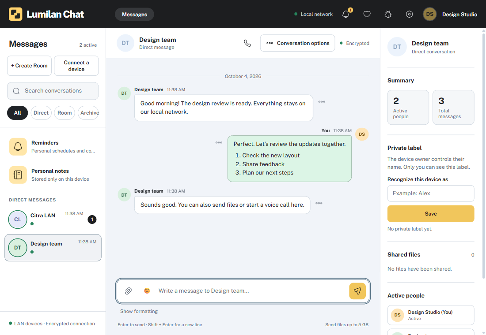
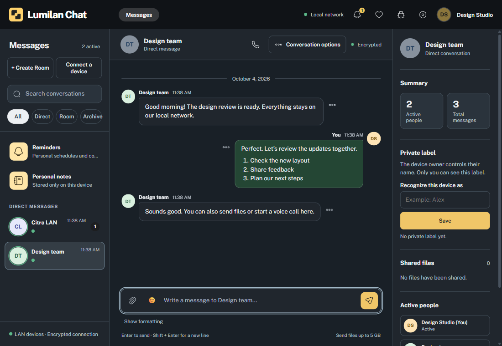
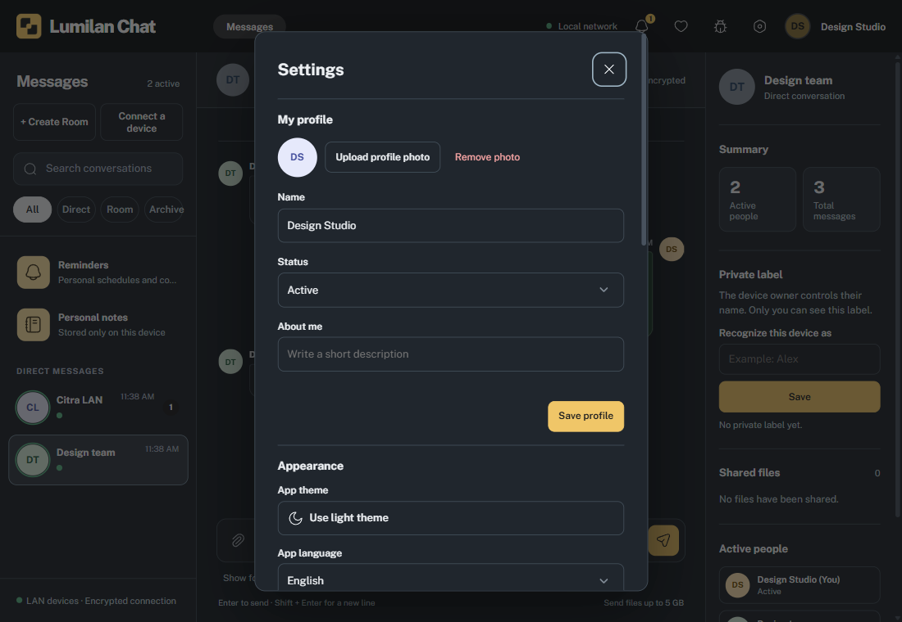

<h1 align="center">Lumilan Chat</h1>

<strong>Jaringan Anda. Percakapan Anda.</strong> Chat langsung, berbagi file, panggilan suara, dan pengingat untuk ruang kerja lokal.

<a href="https://github.com/iyansanjaya/lumilan-chat/releases/latest"><strong>Unduh Lumilan Chat</strong></a> · <a href="https://github.com/iyansanjaya/lumilan-chat/issues">Laporkan masalah</a> · <a href="README.md">English</a>

   

Lumilan menghubungkan perangkat secara langsung melalui LAN atau Wi-Fi yang sama. Tanpa akun, server chat pusat, atau relay internet. Buka aplikasi, pilih nama, lalu mulai percakapan.

## Ruang kerja yang dekat dengan Anda

| Terhubung | Atur sesuai kebutuhan |
| --- | --- |
| **Pesan pribadi & Ruang berundangan** — berbicara langsung atau mengumpulkan tim. | **Catatan pribadi** — simpan pesan dan lampiran hanya di perangkat Anda. |
| **Berbagi file & paste gambar** — kirim setiap file hingga 5 GB ke klien yang kompatibel; tempel gambar yang disalin, periksa, lalu tekan Kirim. | **Pengingat** — jadwalkan tugas sendiri atau minta kontak aktif memilih dan menerima jadwal. |
| **Panggilan suara** — audio satu lawan satu melalui jaringan lokal. | **Lumi** — pemberitahuan ringkas di latar belakang, dengan fallback notifikasi sistem saat diperlukan. |

<strong>Lihat tema gelap dan pengaturan</strong>

Screenshot memakai profil demo terisolasi dan perangkat uji lokal; tidak memuat percakapan pengguna.

## Unduh

> [!WARNING]
> **Paket saat ini belum ditandatangani.** Windows atau macOS mungkin menampilkan peringatan penerbit. Unduh hanya dari halaman Releases resmi. Pengelola tidak dapat memverifikasi salinan pihak lain dan tidak bertanggung jawab atas kerusakan, kehilangan data, atau risiko keamanan yang ditimbulkannya.

Ambil paket terbaru dari [halaman Releases resmi](https://github.com/iyansanjaya/lumilan-chat/releases/latest).

| Sistem | Pilih paket ini |
| --- | --- |
| Windows 64-bit | `Lumilan Chat Setup *.exe` |
| macOS 13+ Intel | DMG Intel / x64 |
| macOS 13+ Apple Silicon | DMG Apple Silicon / arm64 |
| Linux 64-bit | `*.AppImage` |

Fitur khusus platform bergantung pada paket terpasang dan desktop environment. Lumi diimplementasikan untuk Windows, macOS Intel/Apple Silicon, dan Linux X11; Linux Wayland memakai notifikasi sistem. Build yang sukses saja belum membuktikan kompatibilitas native seluruh fitur.

## Mulai dalam tiga langkah

1. **Buka Lumilan** pada perangkat yang terhubung ke LAN atau Wi-Fi yang sama.
2. **Pilih nama Anda.** Perangkat yang terhubung muncul di daftar pesan pribadi.
3. **Mulai percakapan.** Pilih orang, atau gunakan **Buat Ruang** untuk Ruang Percakapan berundangan maupun Ruang Pengumuman.

Ruang Pengumuman menyiarkan ke perangkat aktif yang mengizinkannya. Pesan pribadi, pesan Ruang, dan transfer file memerlukan penerima yang dapat dijangkau; pengiriman tidak diantrekan untuk penerima offline. Kontak Pengingat hanya tampil saat aktif dan mendukung fitur tersebut. Pengingat pribadi berjalan lokal; permintaan yang sudah dibuat mempertahankan status pengiriman atau keputusan jika koneksi terputus.

Pada pembukaan pertama, paket terpasang yang mendukung fitur ini mengaktifkan buka saat masuk ke komputer. Ubah di **Pengaturan → Saat komputer dinyalakan**. Agar tetap menerima pesan setelah jendela ditutup, aktifkan **Tetap berjalan di tray**; tray harus tersedia.

## Privasi dan batasan jaringan

Koneksi memakai **libp2p Noise** untuk mengenkripsi lalu lintas dan mengautentikasi identitas perangkat. Nama profil dipilih sendiri dan tidak memverifikasi identitas orang. Riwayat, file, dan pengaturan lokal **belum terenkripsi**; gunakan jaringan tepercaya dan enkripsi disk sesuai kebutuhan.

Penemuan perangkat bergantung pada mDNS lokal, dan lalu lintas langsung harus diizinkan firewall serta aturan Wi-Fi/VLAN. Lumilan tidak memakai relay internet untuk melewati isolasi jaringan. Panggilan suara memerlukan izin mikrofon dan lalu lintas UDP lokal langsung.

## Bantu Lumilan berkembang

Dikembangkan oleh [Iyan Sanjaya](https://iyansanjaya.com/). Menemukan masalah? Gunakan **Laporkan bug** di header aplikasi atau [buka issue](https://github.com/iyansanjaya/lumilan-chat/issues).

 

Dukungan dalam jumlah berapa pun membantu pengembangan Lumilan. Ikon **Dukung Aplikasi** menyediakan Trakteer untuk Indonesia dan Ko-fi untuk pendukung internasional.
